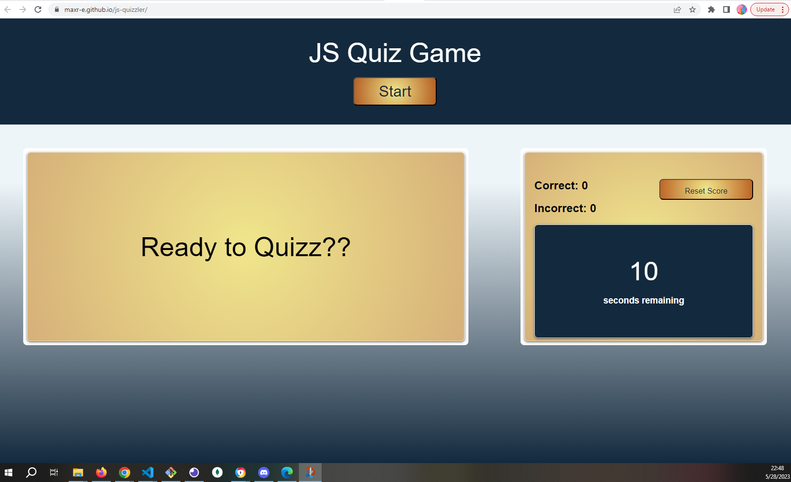

# JS Quizzler

  

## Description
This webpage contains a multiple-choice question quiz designed to test knowledge of programming basics with javascript. It demonstrates the abilities of my coding and page design technique, reflecting what I have learned so far.

## Table of Contents
  * [Installation](#installation)
  * [Usage](#usage)
  * [Tests](#tests)
  * [Contributing](#contributing)
  * [Credits](#credits)
  * [License](#license)
  
## Installation
  
  N/A
  
## Usage
  Dependencies required:
  N/A

  Screenshots of project in action:

  
  
## Tests
  N/A
  
## Contributing

## Credits

N/A

## License:

MIT

Copyright 2023

        Permission is hereby granted, free of charge, to any person 
        obtaining a copy of this software and associated documentation 
        files (the “Software”), to deal in the Software without restriction, 
        including without limitation the rights to use, copy, modify, 
        merge, publish, distribute, sublicense, and/or sell copies of 
        the Software, and to permit persons to whom the Software is 
        furnished to do so.
        
        THE SOFTWARE IS PROVIDED “AS IS”, WITHOUT WARRANTY OF ANY KIND, 
        EXPRESS OR IMPLIED, INCLUDING BUT NOT LIMITED TO THE WARRANTIES 
        OF MERCHANTABILITY, FITNESS FOR A PARTICULAR PURPOSE AND 
        NONINFRINGEMENT. IN NO EVENT SHALL THE AUTHORS OR COPYRIGHT 
        HOLDERS BE LIABLE FOR ANY CLAIM, DAMAGES OR OTHER LIABILITY, 
        WHETHER IN AN ACTION OF CONTRACT, TORT OR OTHERWISE, ARISING 
        FROM, OUT OF OR IN CONNECTION WITH THE SOFTWARE OR THE USE OR 
        OTHER DEALINGS IN THE SOFTWARE.

## Contact Me
  * GitHub: maxr-e
  * Email: maxroyal.eisenberg@gmail.com

